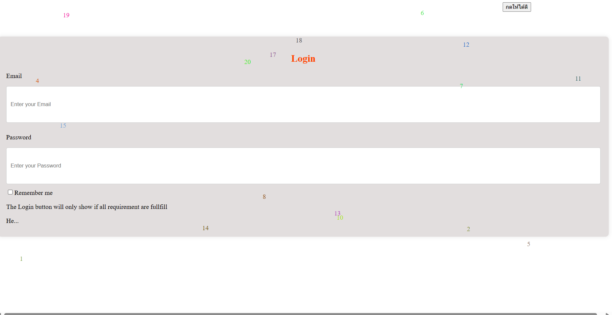

Login page in /login
Demographic page in /demo

first, the attribute directive is random-buttom directive, used when the button (in login form) is hovered it will randomly go to random place in page
second is the structural directive when the login form is clicked, it will randomly generate number with random color in random place

Reduce pipe will reduce the string letter to value you set, then add ...

